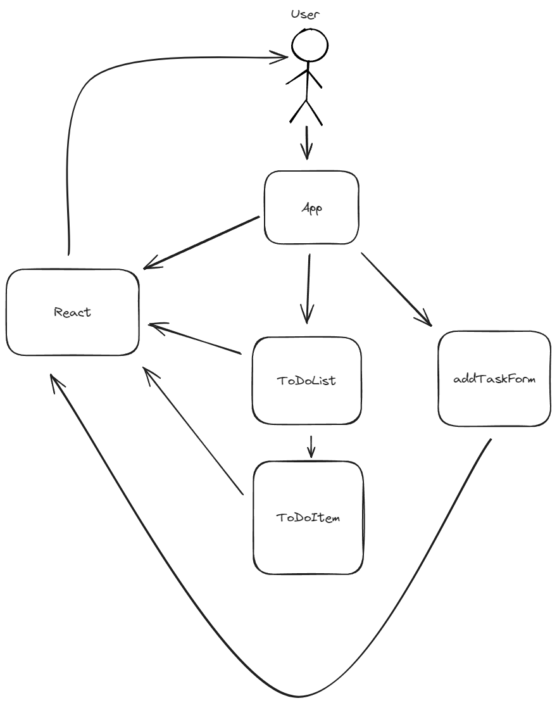

# README #
    Simple React To-Do List
## Objectives

    Проект направлен на создание простого и удобного списка задач с базовой функциональностью: добавление, удаление, отметка выполнения задач, редактирование и сортировка. Основная цель — изучение React и взаимодействие между компонентами, а также реализация основного CRUD-функционала.
### High-Level Architecture

    Архитектура приложения будет включать следующие основные компоненты:

- App: Главный компонент приложения, который управляет состоянием списка задач и передает данные компонентам.
- ToDoList: Компонент, который отображает список всех задач, полученных от компонента App.
- ToDoItem: Отдельный компонент для каждой задачи, включает название задачи, кнопку для удаления, отметку выполнения и возможность редактирования.
- AddTaskForm: Компонент формы для добавления новой задачи с полем ввода и кнопкой добавления.

    Все компоненты взаимодействуют через props и state. Состояние задач (список и изменения) хранится в компоненте App, что обеспечивает "единый источник правды".
### Components

- App.js: Основной компонент, где будет храниться состояние приложения (список задач) и функции для управления им.
- ToDoList.js: Компонент, принимающий массив задач из App.js и рендерящий каждый элемент ToDoItem.
- ToDoItem.js: Компонент для отдельной задачи, включает кнопку для удаления и отметку выполнения.
- AddTaskForm.js: Форма, позволяющая пользователям добавлять новую задачу в список.

### Workflow

    Инициализация проекта: Установка React и необходимых зависимостей (например, create-react-app для создания структуры проекта).
    Создание компонента App: Определение состояния, включающего список задач и функции для добавления, удаления и обновления задач.
    Добавление компонентов:
- ToDoList для отображения списка.
- ToDoItem для каждой задачи.
- AddTaskForm для ввода новой задачи.
    Реализация функциональности:
- Логика для добавления задач через AddTaskForm.
- Логика для удаления и отметки выполнения в ToDoItem.
UI стилизация: Использование CSS для создания минималистичного и интуитивного интерфейса.
Тестирование: Проверка функциональности и исправление ошибок.

