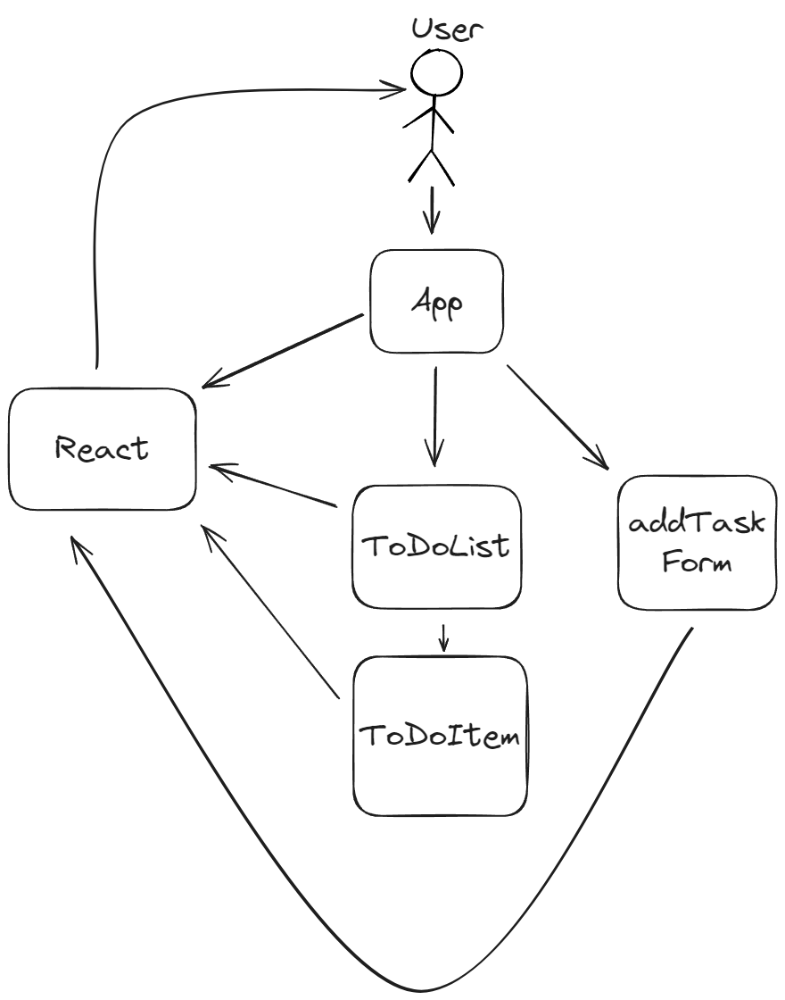

# README #

Simple React To-Do List

# Table of contents

1. [Objectives](#objectives)
2. [High-Level Architecture](#high_level_arhitecture)
3. [Components](#components)
4. [Workflow](#workflow)
5. [Technologies](#technologies)
6. [Instalation and running](#installation)
7. [Team](#team)

## Objectives <a name="objectives"></a>

---
The project aims to create a simple and convenient task list with basic functionality: adding, deleting, marking tasks as completed, editing and sorting.
The main goal is to study React and interaction between components, as well as implementing basic CRUD functionality.

## High-Level Architecture <a name="high_level_arhitecture"></a>

The application architecture will include the following main components:

- **App:** The main application component that manages the state of the task list and passes data to components.
- **ToDoList:** A component that displays a list of all tasks received from the App component.
- **ToDoItem:** A separate component for each task, includes the task name, a button for deleting, a completion mark, and the ability to edit.
- **AddTaskForm:** A form component for adding a new task with an input field and an add button.

All components interact via props and state. The state of tasks (list and changes) is stored in the App component, which provides a "single source of truth".

## Components <a name="components"></a>

- **<a href="to_do_list/src/App.js">App.js:</a>** <br>
App.js is the root component of the To-Do List application. <br>
Its purpose is to manage the state of tasks, provide functionality for interacting with them (adding, deleting, editing, changing status), and delegate data display to child components. <br>
Architectural structure

### Input: <br>

**User input**: <br>
New task text (via the AddTaskForm component). <br>
User actions: <br>

- adding,
- deleting,
- changing status,
- editing a task.
Filter selection (all, active, completed).
**Internal states of the App component**:
- Task list.
- Selected filter.

### Output

A filtered and sorted list of tasks passed to the ToDoList component.
Task management functions (addTask, deleteTask, toggleComplete, updateTask) passed to child components.

- **<a href="to_do_list/src/components/ToDoList.js">ToDoList.js:</a>** # **README for ToDoList Component**

# **README for ToDoList Component**

## **Overview**

The `ToDoList` component is a reusable React component designed to render a dynamic list of tasks. It delegates the display and interaction of each task to the `ToDoItem` component, enabling modular and scalable task management functionality.

---

## **Features**

- Displays a list of tasks from a given array.
- Allows deletion of tasks through a provided `deleteTask` callback.
- Enables toggling of task completion status using the `toggleComplete` callback.

---

## **Installation**

To use the `ToDoList` component in your project, ensure you have the following:

1. A React environment set up.
2. The `ToDoItem` component, as it is a dependency of `ToDoList`.

### **Steps**

1. Clone or copy the `ToDoList.js` file and ensure the `ToDoItem.js` component is implemented in the same directory.
2. Import the `ToDoList` component into your project:
    
    ```jsx
    import ToDoList from './ToDoList';
    ```


## **Folder Structure**

Ensure your project has the following structure for proper usage:

```
src/
├── components/
│   ├── ToDoList.js
│   ├── ToDoItem.js
``` 

---

## **Dependencies**

- **React**: Ensure you have React installed (`react` and `react-dom`).
- **ToDoItem Component**: Implement or include the `ToDoItem` component.
<br>
- **<a href="to_do_list/src/components/ToDoItem.js">ToDoItem.js:</a>** A component for a single task, including a delete button and a complete mark.
### Input and Output

#### Input:

The `ToDoItem` component takes the following as inputs:

**Props:**

- `task`: An object containing the task details (ID, name, and completion state).
- `deleteTask`: A function to handle the task deletion.
- `toggleComplete`: A function to toggle the completion status of the task.
- `updateTask`: A function to update the task name.

**User Input:**

- Text input for editing task names when in editing mode.

#### Output:

The component provides the following outputs:

- Renders a styled `<li>` element representing the task with:
  - Task name or an editable input field.
  - Buttons for editing, completing/unmarking, and deleting.
- Calls to the provided functions (`deleteTask`, `toggleComplete`, `updateTask`) with the relevant task ID and data based on user interaction.
Why did Mark bring a ladder and a Dr. Pepper to the party?

Because he wanted to reach new heights and stay peppered up! 
- **<a href="to_do_list/src/components/AddTaskForm.js">AddTaskForm.js:</a>**

This React component, AddTaskForm, allows users to add new tasks via a form. It uses the following key features:

- State Management: The taskName state tracks the current input value.
- Event Handling:
    - onChange updates the taskName state with the input's value.
    - onSubmit prevents default form behavior, validates the input, and calls the addTask function (received as a prop) to add the task. It then clears the input field.
- UI: A form with a text input field and a submit button.

This component ensures clean handling of user input and task submission.

## Workflow <a name="workflow"></a>

---

**Initialize the project:** Install React and necessary dependencies (e.g. create-react-app to create the project structure). <br>
**Create the App component:** Define a state that includes a list of tasks and functions to add, remove, and update tasks.<br>
**Add components:** <br>

- ToDoList to display the list. <br>
- ToDoItem for each task. <br>
- AddTaskForm to enter a new task.<br>

**Implement the functionality:** <br>

- Logic for adding tasks via AddTaskForm. <br>
- Logic for removing and marking complete in ToDoItem. <br>
UI styling: Using CSS to create a minimalist and intuitive interface.
Testing: Checking the functionality and fixing bugs.

## Technologies: <a name="technologies"></a>

- HTML - implementation of the site's base <br>
- CSS - implementation of the site's style <br>
- JavaScript/React - implementation of the site's mechanics <br>
- PostgreSQL - implementation of the user database

**Budget:** <br>
0 dollars

## Installation and running <a name="installation"></a>

---

```shell
# Clone the repository
git clone <repository_URL>

# Navigate to the project directory
cd <project_folder_name>

# Install dependencies
npm install

# Start the application
npm start
```


## Team <a name="team"></a>

---

### Team Lead

**Alan Arzumanajns** <br>
<alanarzumanjans@gmail.com>

### Developers

**Mark Korobkin** <br>
<markkorobkin85@gmail.com> <br>
**Danila Petrikov** <br>
<danilapetrikov563@gmail.com> <br>
**Ilja Prohodko** <br>
<iljabomz9@gmail.com>

---
